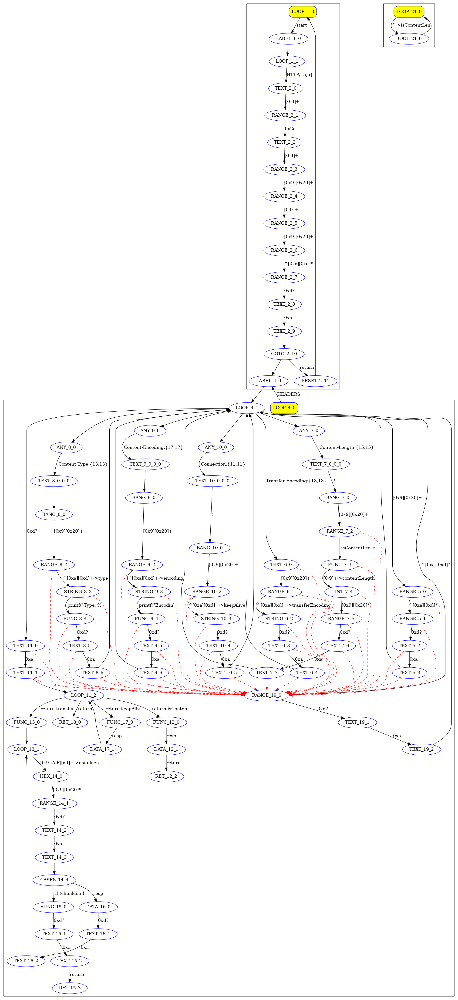

This is a demonstration of using the HttResponse parsing example.
The code (httpResp.h and httpResp.cc) was automatically generated using vProto at https://cgen.dev
The application demonstrates the operation of both: full-http and any byte-level data fragmentation.

The application uses input test data from 'input.txt' and outputs the result to the file 'output.txt'.



### cmake Build/Run/Clean:
To build, run, or clean projects using this Makefile, execute the following commands:
```bash
cmake -B build
```
```bash
cd ./build
```
```bash
make
```
```bash
make install
```
```bash
make uninstall
```

### Example of usage
- **Include** "httpResp.h" (#include "httpResp.h")
- **Declare** user functions from "httpRespResult" (section "Don't forget to declare" from .h file)
- **Add Linking Library** -lhttpResp (libhttpResp.a)
